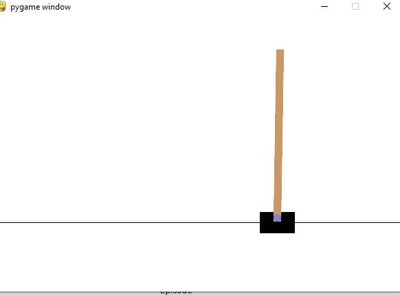
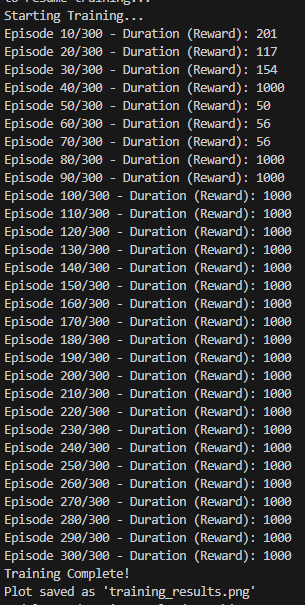
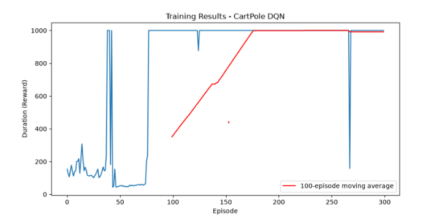
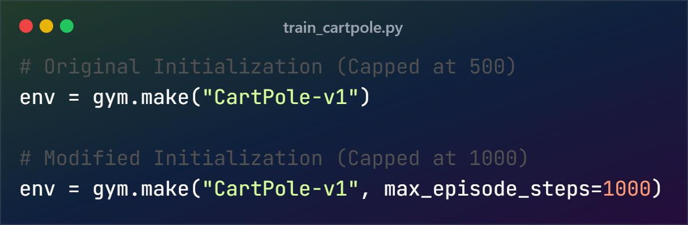
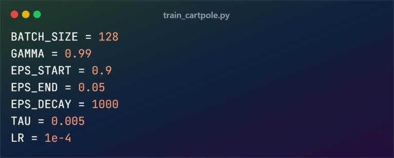

# CartPole_Assignment

## Introduction

The CartPole problem is a classic reinforcement learning environment. The objective is to keep a pole balanced upright on a moving cart for as long as possible. The cart can be pushed left or right, and the environment provides a reward for every time step the pole remains upright. If the pole falls past a certain angle or the cart moves too far from the center, the episode terminates.



## Markov Decision Process (MDP) Formulation

To solve this problem using reinforcement learning, we model it as an MDP defined by a tuple $(S, A, P, R, \gamma)$:

## Algorithm: Deep Q-Network (DQN)

For this assignment, we implemented the Deep Q-Network (DQN) algorithm. DQN extends standard Q-learning by using a neural network to approximate the Q-value function $Q(s, a)$.

### Network architecture:

The Q-network is a Multi-Layer Perceptron (MLP) built with PyTorch. It takes the 4-dimensional state vector as input and outputs the estimated Q-values for the 2 possible actions. The architecture consists of:

- Input Layer (4 nodes) → Hidden Layer 1 (128 nodes, ReLU activation)
- Hidden Layer 1 → Hidden Layer 2 (128 nodes, ReLU activation)
- Hidden Layer 2 → Output Layer (2 nodes, Linear activation)

### Key points:

To stabilize training, DQN utilizes two key mechanisms:

1. **Experience Replay Buffer**: Instead of training on consecutive frames (which are highly correlated), the agent stores transitions $(s, a, r, s')$ in a memory buffer. During training, random mini batches of size 128 are sampled, breaking the correlation between experiences and stabilizing the network.

2. **Target Network**: Two identical networks are used: a Policy Network (updated at every step) and a **Target Network** (used to calculate the target Q-value). The Target Network is updated slowly using a "soft update" approach ($\tau = 0.005$) to prevent the target values from oscillating erratically.

### Exploration strategy:

The agent explores the environment using an $\epsilon$-greedy strategy. With probability $\epsilon$, it takes a random action, and with probability $1-\epsilon$, it exploits the known Q-values. $\epsilon$ starts at 0.9 and decays exponentially to a minimum of 0.05.

## Result:

The agent was trained for up to 500 episodes using an AdamW optimizer with a learning rate of $1 \times 10^{-4}$.



As seen in the plot, the agent initially performs randomly (low reward duration), but as the neural network converges, the episode duration consistently approaches the maximum of 500 steps. The 100-episode moving average demonstrates stable learning and solving of the environment.

1. **Blue line (Raw performance):**
   The blue line shows the agent's score in each episode. It is noisy and fluctuates, which is normal in Reinforcement Learning because:
   - **Exploration:** The agent sometimes takes random actions (controlled by **epsilon, ε**) to discover better strategies.
   - **Learning Instability:** As the neural network updates, it may temporarily perform worse before improving again.

2. **The red line (100-Episodes moving average):**
   The red line shows the average score over the last 100 episodes, making it much smoother than the blue line. It is the most important metric for evaluating a Reinforcement Learning agent. If the red line rises over time, it indicates that the agent is successfully learning and improving.



## Advanced calculations

### Increasing the Maximum Reward Limit

By default, the CartPole-v1 environment implemented in the Gymnasium library restricts the maximum episode length to 500 steps. Consequently, the maximum achievement is capped at 500. To observe the agent balancing the pole for extended durations (e.g., 1000 or 2000 steps), the environment initialization must be modified.

Below is the necessary adjustment to the code to increase the limit to 2000 steps:



### Managing Model Memory and Resuming Training

The training script is designed with a state-retention mechanism. Upon starting, it searches the directory for a previously saved model weights file named `cartpole_dqn.pth`. If this file is detected, the script loads the pre-existing weights to resume training, preventing the loss of prior learning.

### Deleting Previous Knowledge

If the objective is to force the neural network to completely "forget" its previous knowledge and learn the environment dynamics from absolute zero, you must intervene manually.

To reset the training:

1. Navigate to your project directory.
2. Locate the file named `cartpole_dqn.pth`.
3. Delete the file (or rename it if you wish to preserve it as a backup).

Upon the next execution, the script will default to the "Starting training from scratch" condition, re-initializing all neural network weights to random values.

## Adding variation in gymnasium environment

Several rounds of training were run while progressively modifying the environment's physics (force magnitude, gravity, pole mass, and pole length) to test how robust the DQN agent's learned policy was to changes in the underlying dynamics. Across repeated training runs (1st through 9th training), the agent's raw episode duration (blue line) remained noisy due to exploration and learning instability, but the 100-episode moving average (red line) trended upward across most runs, and later runs consistently reached the maximum episode duration of 1000 steps, confirming the model was well trained.

## Adding variations in model

### Change the neural network and activation function:

Currently it has 2 neural networks of 128 nodes each.

Changed it from 128 to 256 nodes (a bigger brain) and added a `self.layer4` to make the network deeper, and changed the activation function from `F.relu` to `torch.sigmoid`.



### Changing hyperparameters (the learning rate):

- **LR = 1e-4 (Learning Rate):** This controls how big of a step the network takes when updating its knowledge.
- **BATCH_SIZE = 128:** How many memories it looks at simultaneously while training.

Changes applied:

- **LR = 1e-4 → 1e-3:** Learns faster, but might be unstable.
- **BATCH_SIZE:** Raised to 256.

### Change the exploration rate (ε-greedy):

`EPS_DECAY = 1000`. If we lower this to 500, the agent stops acting randomly much earlier in the training. If you raise it to 2000, it will continue to explore randomly for a much longer time.

Changed it to 2000 so that the model will explore more.

### Start training the model after variations:

Ten additional training runs were conducted with the modified network (256 nodes, 4 layers, sigmoid activation), the higher learning rate (1e-3), larger batch size (256), and the extended exploration decay (2000). Early runs after these changes were noisy and unstable — with `LR = 1e-3` the model explored more in a messy form — but later runs (3rd through 10th) again reached and sustained the maximum reward of 1000, showing the deeper network eventually converged despite the more aggressive hyperparameters.

## How to Run the Model

1. Install dependencies:
   ```
   pip install torch gymnasium matplotlib numpy
   ```
2. To resume/start training the model, run:
   ```
   python train_cartpole.py
   ```
3. To watch the trained agent play, run:
   ```
   python test_cartpole.py
   ```
   (Note: The script automatically loads the pre-trained weights from `cartpole_dqn.pth`.)

## Conclusion

This assignment successfully demonstrated the application of Deep Reinforcement Learning to solve the classic CartPole control problem. The initial implementation utilized a Deep Q-Network (DQN) paired with an Experience Replay Buffer and a Target Network, which allowed the agent to stably learn an optimal policy and reach the environment's maximum reward limit.

Beyond the base requirements, several advanced experiments were conducted to test the robustness and flexibility of the DQN algorithm:

1. **Extreme Physics Simulation:** The underlying physical constraints of the Gymnasium environment were heavily modified to simulate extreme conditions. Gravity increased from 9.8 to 50.0, the pole mass increased to 1.0, and the force magnitude applied by the cart quadrupled to 40.0. This created a highly volatile environment where the standard policy immediately failed.

2. **Network and Training Scaling:** To accommodate the drastically increased complexity of the new physics engine, the neural network architecture was deepened to four layers utilizing Sigmoid activations. Furthermore, the environment's maximum reward threshold was raised to 1000 steps, and the training cycle was extended to 900 episodes, giving the deeper network sufficient data and time to converge.

3. **State Retention (Model Saving/Loading):** A persistence mechanism was implemented to save the neural network's learned weights (`.pth` files). This allowed the agent to pause and resume training over multiple sessions without catastrophic forgetting, significantly improving the efficiency of the training process by lowering the exploration rate (ε) upon resuming.