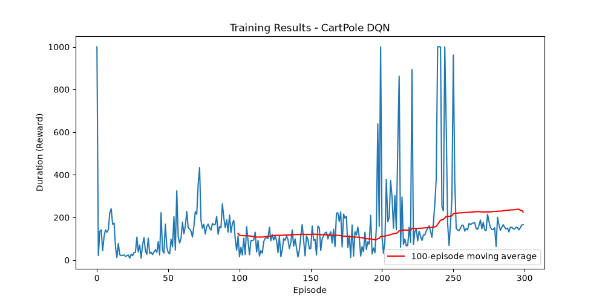

# Reinforcement Learning Assignment: Solving CartPole with DQN

## 1. Introduction
The CartPole problem is a classic reinforcement learning environment. The objective is to keep a pole balanced upright on a moving cart for as long as possible. The cart can be pushed left or right, and the environment provides a reward for every time step the pole remains upright. If the pole falls past a certain angle or the cart moves too far from the center, the episode terminates.

## 2. Markov Decision Process (MDP) Formulation
To solve this problem using reinforcement learning, we model it as an MDP defined by a tuple $(S, A, P, R, \gamma)$:

### 2.1 State Space ($S$)
The state space consists of four continuous variables describing the physical state of the cart and pole:
1. **Cart Position**: Position of the cart on the track (from -4.8 to 4.8).
2. **Cart Velocity**: Velocity of the cart.
3. **Pole Angle**: Angle of the pole in radians (from -0.418 to 0.418 rad).
4. **Pole Angular Velocity**: Angular velocity of the pole.

### 2.2 Action Space ($A$)
The agent can take two discrete actions:
- **0**: Push cart to the left.
- **1**: Push cart to the right.

### 2.3 Reward Function ($R$)
The agent receives a reward of **+1** for every time step the pole remains upright. The maximum reward per episode in `CartPole-v1` is 500 or any max_episode_steps.

### 2.4 Transition Dynamics ($P$)
The transition dynamics dictate how the state evolves given the current state and action. These are governed by the physics simulator in the Gymnasium environment, updating the position, velocity, angle, and angular velocity in each time step.

### 2.5 Discount Factor ($\gamma$)
A discount factor $\gamma = 0.99$ is used to prioritize long-term rewards while ensuring convergence of the Q-values.

## 3. Algorithm: Deep Q-Network (DQN)
For this assignment, we implemented the Deep Q-Network (DQN) algorithm. DQN extends standard Q-learning by using a neural network to approximate the Q-value function $Q(s, a)$.

### 3.1 Network Architecture
The Q-network is a Multi-Layer Perceptron (MLP) built with PyTorch. It takes the 4-dimensional state vector as input and outputs the estimated Q-values for the 2 possible actions. The architecture consists of:
- Input Layer (4 nodes) $\rightarrow$ Hidden Layer 1 (128 nodes, ReLU activation)
- Hidden Layer 1 $\rightarrow$ Hidden Layer 2 (128 nodes, ReLU activation)
- Hidden Layer 2 $\rightarrow$ Output Layer (2 nodes, Linear activation)

### 3.2 Key Components
To stabilize training, DQN utilizes two key mechanisms:
1. **Experience Replay Buffer**: Instead of training on consecutive frames (which are highly correlated), the agent stores transitions $(s, a, r, s')$ in a memory buffer. During training, random mini-batches of size 128 are sampled, breaking the correlation between experiences and stabilizing the network.
2. **Target Network**: Two identical networks are used: a **Policy Network** (updated at every step) and a **Target Network** (used to calculate the target Q-value). The Target Network is updated slowly using a "soft update" approach ($\tau = 0.005$) to prevent the target values from oscillating erratically.

### 3.3 Exploration Strategy
The agent explores the environment using an $\epsilon$-greedy strategy. With probability $\epsilon$, it takes a random action, and with probability $1-\epsilon$, it exploits the known Q-values. $\epsilon$ starts at 0.9 and decays exponentially to a minimum of 0.05.

## 4. Results
The agent was trained for up to 500 episodes using an AdamW optimizer with a learning rate of $1\times 10^{-4}$.

*(Insert your generated `training_results.png` here after running the script)*

As seen in the plot, the agent initially performs randomly (low reward duration), but as the neural network converges, the episode duration consistently approaches the maximum of 500 steps. The 100-episode moving average demonstrates stable learning and solving of the environment.

## 5. Conclusion
The implementation of DQN successfully solved the CartPole-v1 environment. By leveraging an experience replay buffer and a target network, the neural network was able to stably learn an optimal policy mapping continuous states to discrete actions. This assignment demonstrates the effectiveness of Deep Reinforcement Learning in solving classical control tasks.
